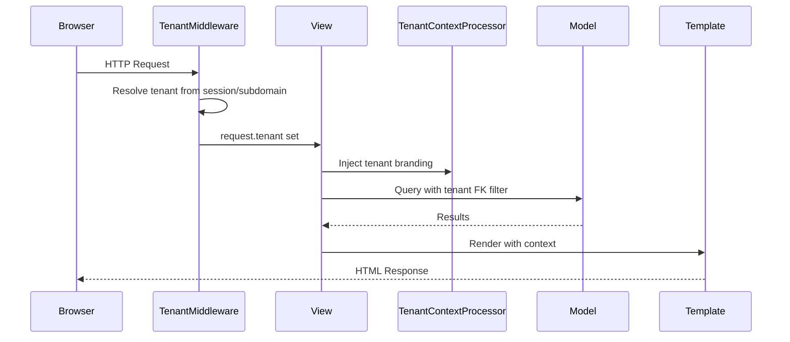

# CafeMS — Architecture

## System Overview

CafeMS is a **multi-tenant Cafe/Cafeteria Management System** built on Django. Each tenant (organization) is fully isolated from others.

## Request Lifecycle



## Multi-Tenancy Strategy

| Environment | Strategy |
|---|---|
| **Development (SQLite)** | Shared schema with `tenant` FK on every model |
| **Production (PostgreSQL)** | Schema-per-tenant via `django-tenants` |

The codebase supports both modes. The `TenantMiddleware` sets `request.tenant` transparently.

## Module Map

```
┌─────────────────────────────────────────────────────────┐
│                    CafeMS Platform                       │
├─────────────┬──────────────────────────────────────────┤
│  Public     │  Super Admin Panel                        │
│  Schema     │  • Tenant CRUD (create/suspend/activate)  │
│             │  • Platform health dashboard              │
├─────────────┴──────────────────────────────────────────┤
│                   Per-Tenant Schema                      │
│                                                          │
│  ┌──────────┐  ┌───────────┐  ┌──────────────────────┐ │
│  │ Accounts │  │ Employees │  │ Menu                 │ │
│  │ User     │  │ Employee  │  │ MenuCategory         │ │
│  │ (Roles)  │  │ Dept      │  │ TeaItem              │ │
│  │          │  │ AuditLog  │  │ LunchMenuPlan        │ │
│  └──────────┘  └───────────┘  │ DailyLunchEstimate   │ │
│                                └──────────────────────┘ │
│  ┌──────────┐  ┌───────────┐  ┌──────────────────────┐ │
│  │   POS    │  │  Tokens   │  │ Requests             │ │
│  │ TeaItem  │  │ LunchToken│  │ TokenOpenCloseReq    │ │
│  │ Sale     │  │           │  │ (2PM PKT cutoff)     │ │
│  └──────────┘  └───────────┘  └──────────────────────┘ │
│  ┌──────────┐  ┌───────────┐  ┌──────────────────────┐ │
│  │ Billing  │  │  Notifs   │  │ Reports              │ │
│  │ Monthly  │  │ Notific.  │  │ PDF/Excel Export     │ │
│  │ Bill     │  │           │  │                      │ │
│  │ Payment  │  └───────────┘  └──────────────────────┘ │
│  │ MiscChg  │                                           │
│  └──────────┘                                           │
└─────────────────────────────────────────────────────────┘
```

## Role Hierarchy

```
Super Admin (platform-level, no tenant data access)
    └── Admin (full tenant control)
            ├── Cafe Staff (operations: POS, tokens, requests)
            ├── Committee Member (approve bills, read reports)
            └── Employee (self-service portal)
```

## Key Design Decisions

See [decisions.md](decisions.md) for the full log.

## Database Model Relationships

### Core FK chain
```
Tenant → Employee → LunchToken → DailyLunchEstimate → LunchMenuPlan
       → MonthlyBill → Payment
       → TeaItemSale
       → TokenOpenCloseRequest
       → Notification → User
```

### AuditLog
Every admin edit (especially backdated) writes to `AuditLog` with before/after JSON snapshot.

## Celery Scheduled Tasks

| Task | Schedule | Purpose |
|---|---|---|
| `check_request_cutoff` | Every hour | Mark expired open/close requests |
| `generate_reminder_emails` | Daily 9AM PKT | Unpaid bill reminders |
| `daily_closing_report` | 6PM PKT | Auto-generate closing report |
